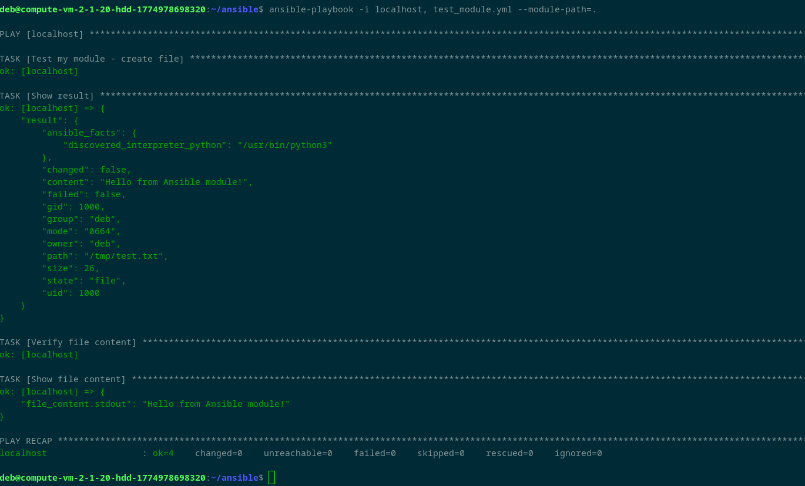
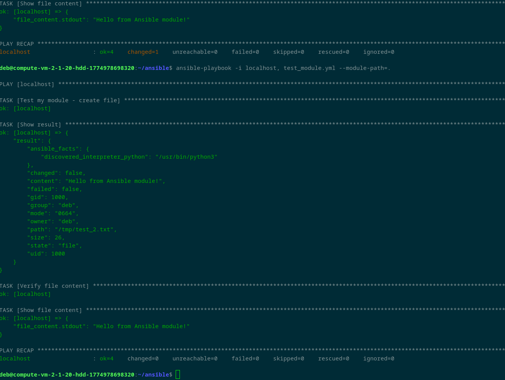
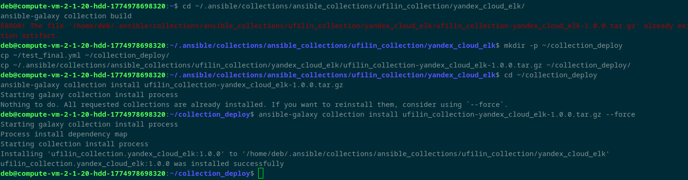
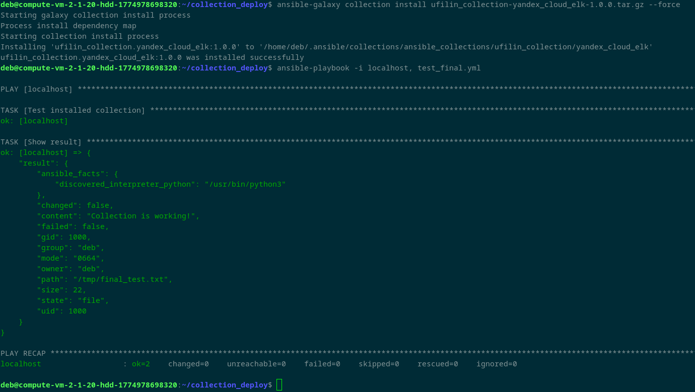

# Ansible Collection

Этот репозиторий содержит Ansible collection с пользовательскими модулями.

## Структура коллекции

- `yandex_cloud_elk/` - основная коллекция
  - `plugins/modules/my_own_module.py` - модуль для создания файлов

## Установка

ansible-galaxy collection install ufilin_collection-yandex_cloud_elk-1.0.0.tar.gz

## Результат выполнения в скриншотах

  

  

  

  

